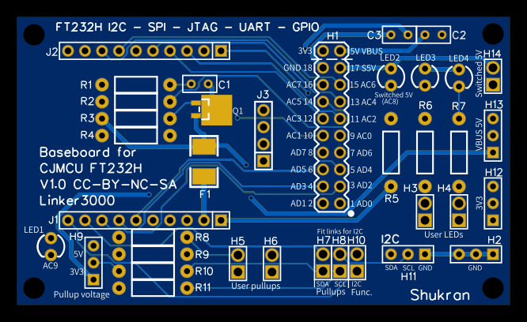
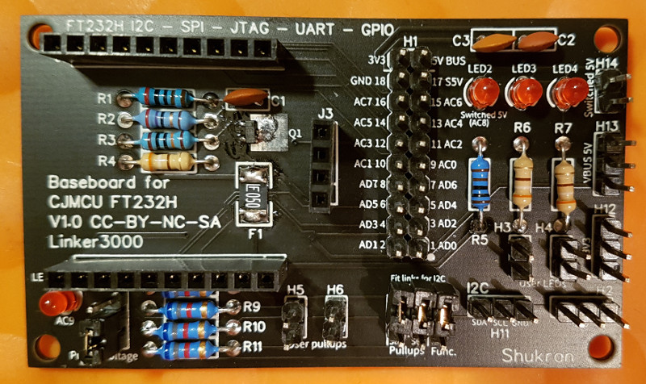
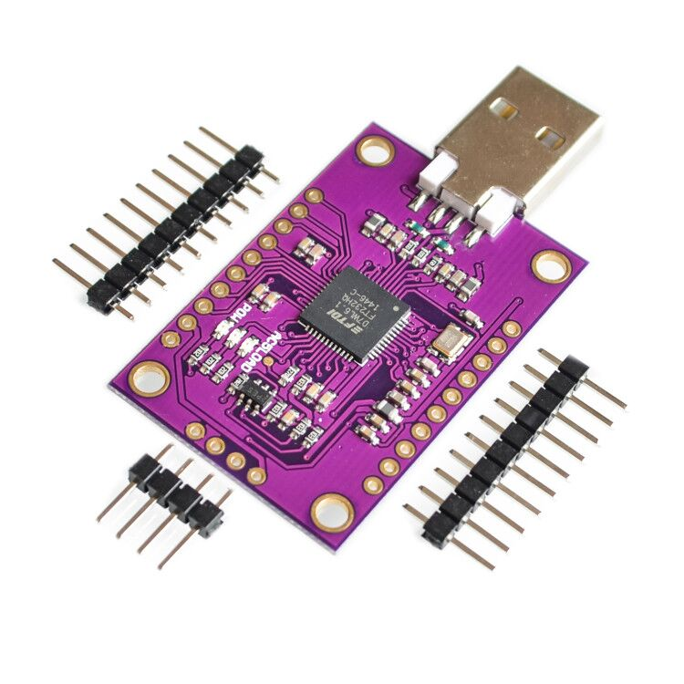
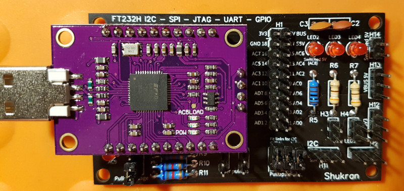
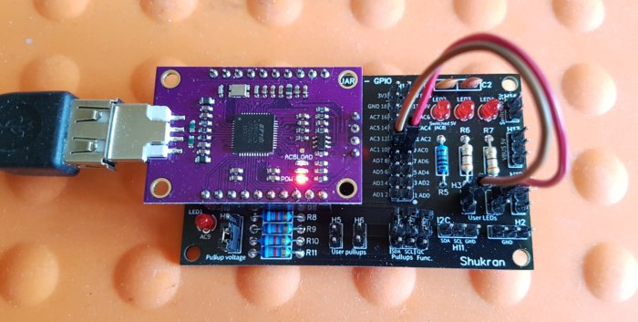
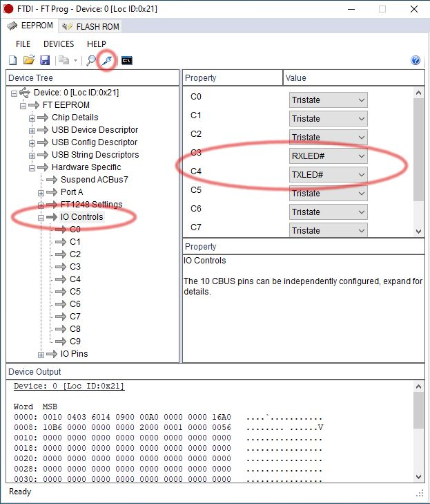
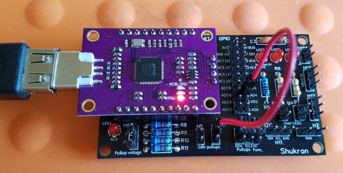
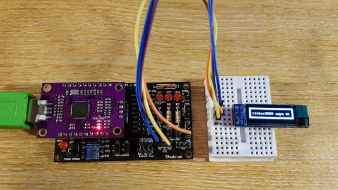

LICENCE: CC BY-SA-NC

**This is a hobby project and comes with no official support. The PCB schematic and board design files are offered 'as is' with no claims made about their fitness for any specific purpose. As with any device capable of modifying the contents of flash chips and other connectable/communicatable devices, you can affect the operation of the host device, or 'brick' it, if you make a mistake so, just like any other FT232H-based board, you use this one at your own risk.**

# Shukran

The FT232H is a versatile multifunction USB to JTAG / UART / FIFO / SPI / I2C chip from FTDI (https://www.ftdichip.com/Products/ICs/FT232H.htm) that has been used on a number of generic interface, flash reader/programmer and signal probing boards - for example:

Name|Supplier|Ref
----------|----------|----------
FT232H breakout board|Adafruit|https://learn.adafruit.com/adafruit-ft232h-breakout/overview
The Shikra|Xipiter|https://int3.cc/products/the-shikra
FT2232H USB 2.0 Hi-Speed breakout board|Seeed Studios|https://www.seeedstudio.com/FT2232H-USB-2-0-Hi-Speed-breakout-board-p-737.html
FTDI UM232H-B breakout board|FTDI|https://www.ftdichip.com/Support/Documents/DataSheets/Modules/DS_UM232H-B.pdf
FT232H breakout board|CJMCU|Various suppliers

This project is a baseboard for the CJMCU FT232H module, which is widely available on auction sites for under $8/£6. 

Plugging a CJMCU board onto the Shukran creates an easy-to-use multi-function bus / device hacking and analysis tool with protected (current limited) 5V power pins, 3.3V power, spare pullup resistors and indicator LEDs, all for around $16/£12 total. The Shukran is designed to be assembled by anyone with moderate soldering skills; all components are through-hole except for two larger, surface mount, ones which should be easy to fit with a soldering iron.

(Board V1.01 has slightly modified screen printing but everything else is the same)

A fully-populated Shukran board provides:

- Breakout pins for the FT232H chip ports, and power rails
- A dedicated I2C header 
- Two dedicated I2C pullups which can be connected/disconnected as needed
- Two spare pullups which can be connected to the breakout pins and VBUS (5V) or 3.3V as needed
- Two user LEDs which can be connected to the breakout pins as required using dupont jumper leads
- Overload-protected 5V and switched VBUS (5V) connection points
- 3.3V and GND connection points
- A dedicated indicator LED on the AC9 bus line

Unlike some FT232H (and FT2232H) breakout boards, all Shukran 5V power pins are protected by a 500mA polyfuse to reduce the risk of overcurrent conditions or damaging the host USB port. 

Board|Current limited 5V power pins
----------|----------
CJMCU FT232H breakout board|NO
Shukran + CJMCU FT232H breakout board|YES (polyfuse)
Adafruit FT232H breakout board|NO
Xipiter The Shikra|YES (polyfuse)
Seeed Studios FT2232H USB 2.0 Hi-Speed breakout board|NO
FTDI UM232H-B|NO 

The assembled 2-board setup is compatible with many common tools and apps, such as CircuitPython and OpenOCD, with the added bonus that the FT232H part is easily replaced if it gets damaged; just pull off the low-cost CJMCU board and fit a new one - no more writing off an expensive board or having to think about replacing a surface-mount chip!

To make a Shukran, you'll need to order the PCB, required components and a CJMCU board. The PCB design files are at: https://easyeda.com/linker3000/Shukran. Bare boards can be ordered directly from JLCPCB, or you can download the design files and use another manufacturer. 

## Bill of materials

ID	Part | Description 
----------|----------
C1-C3|Capacitor 0.1uF 50V ceramic
F1|500mA polyfuse SMD 1206 eg: Bourns MF-MSMF050-2
J1, J2|10-pin 0.1” (2.54mm) header female
J3|4-pin 0.1” (2.54mm) header female
H1|2 x 20-pin 0.1” (2.54mm) header male
H3, H4, H5, H6, H7, H8, H10, H14|2-pin 0.1” (2.54mm) header male
H2, H9, H11, H12, H13|3-pin 0.1” (2.54mm) header male
Q1|P-channel MOSFET 20V 3.7A SOT23 package eg: IRLML6402
R1|Resistor 2K 1/4W
R2|Resistor 27R 1/4W
R3|Resistor 100K 1/4W
R4, R6, R7|Resistor 330R 1/4W
R5|Resistor 680R 1/4W
R8-R11|Resistor 6K8 1/4W (or choose your pullup value, say 4K7 or 10K)
LED1-4|3mm red or green
Misc|4 x PCB jumper links
Misc|Dupont hookup/patch wires - as needed
Misc|USB 2.0 extension Cable: A Male Plug to A Female to connect the assembled unit to the host computer. 

Using a short USB extension cable is recommended to reduce the physical stress of supporting the two-PCB assembly on the host computer's USB port. 

## CJMCU board notes

Make sure you buy the right FT232H CJMCU board - check the image below.

**The header pins must be soldered to the PCB so they point downwards - this also means it's important to buy boards that don't have the header pins pre-soldered to the top of the PCB.**

The board has a power LED and two LEDs fitted to FT232H pins AC3 and AC4. In UART mode, AC3 and AC4 are intended to be used to drive RxLED and TxLED indicators, but they have to be defined as such otherwise they will do nothing unless you specificially control them - see the FTDI docs for the chip and the section below on RxTx LEDs.

## Using the Shukran

The Shukran has a main header (H1) which breaks out the FT232H pins and also provides access to power as follows. All I/O pins are 3V3, 5V tolerant:

Shukran H1 header pin|FT232H pin
----------|----------
1|AD0
2|AD1
3|AD2
4|AD3
5|AD4
6|AD5
7|AD6
8|AD7
9|AC0
10|AC1
11|AC2
12|AC3 (often used as RxLED in Async mode - see above notes about the CJMCU board)
13|AC4 (often used as TxLED in Async mode - see above notes about the CJMCU board)
14|AC5
15|AC6
16|AC7
17|5V, switched on/off by via AC8, NB: This signal is not controllable via regular I/O programming. See FTDI docs.
18|GND
19|5V (VBUS)
20|3V3

In keeping with other designs, AC9 is connected directly to an indicator LED and is not available on a header pin.

Follow the online FT232H examples to connect the correct pins from the Shukran to the target circuit. The pinouts given below are *typical* but some programs may use different ones.

### User LEDs

The user LEDs are for monitoring the state of I/O pins. Connect a jumper wire from the top header pin on H3 or H4 below an LED to the required I/O pin and the second H3/H4 header pin is now also connected to the I/O pin. The LEDs are connected via a resistor to VBUS (5V) and so they will light up when the I/O line is pulled to ground because the FT232H ports are open drain.

In the above picture, the user LEDs are jumpered to show the state of AC0 and AC1. To make other connections to those lines,  the second pins on H3 and H4 are used.

### RxTx LEDs

The CJMCU board has LEDs attached to FT232H lines AC3 and AC4, and the Shukran board has an LED permanently connected to AC9 in accordance with the FT232H reference design. These LEDs can be used as Rx/Tx indicators for async comms, however to set them up as such requires the FT232H's initialisation config to be modified.

The FT232H architecture supports an EEPROM for storing chip configuration information, and FTDI provides a Windows-based tool called FT_PROG for setting-up this info - see: https://www.ftdichip.com/Support/Documents/AppNotes/AN_124_User_Guide_For_FT_PROG.pdf

There is also a linux-based flash read/write tool called *ftdi_eeprom* that comes with the libftdi driver bundle - BUT at the time of writing it does not work properly with the FT232H chip!

The folks at Xipiter wrote a tool in Python to set various options on their 'Shikra' (FT232H) board, and because it's also based on the FTDI chip reference design, this tool also works with the Shukran. You will find the tool here: https://github.com/Xipiter/shikra-programmer. There's also a modified version here: https://github.com/linker3000/shikra-programmer.

The modified version fixes an issue with the original that requires the default FTDI chip kernel module to be removed with *rmmod* in order for the tool to claim access to the board. 

This tool allows AC9 to be defined as the async RxTx LED (read the instructions on the Github page), however it does not support setting AC3/4. Fortunately, the tool does allow FT232H flash memory backups to be taken and restored, and this repo includes three hex files that can be used to set and unset the Rx Tx LEDs by restoring the relevant file:

File | Description 
----------|----------
default.hex|Sets board back to defaults (no LEDs in use)
c9rxtx.hex|AC9 LED set as async RxTx indicator
c3rxc4tx.hex|AC3 = Rx, AC4 = Tx

Once the required file has been restored, the board needs to be unplugged/replugged to reinitialise the FT232H with its new settings.

## User pullups

There are two unassigned pullup resistors for use as needed; connect a jumper wire from either pin of H5 or H6 to the required I/O line and the second pin on the header is now also connected to the I/O pin.

In the above picture, there is a pullup connected to AD4. To make a connection to that line, the second pin on H6 is used.

Fitting jumpers on H7 and H8 (marked SDA and SCL for I2C use), connects pullups to AD1 (SDA) and AD0 (SCL) respectively. These pullups can be used as needed, even for non-I2C protocols.

NB: The jumper position on H9 determines whether the pullup resistors are connected to 5V (jumper on top two pins) or 3.3V (bottom two pins).

### I2C

In I2C mode, the following pins/connections should be used:

Function|FT232H pin|Shukran H1 pin|Pullup (if needed)
----------|----------|----------|---------
SDA|AD1 + AD2|2 + 3 (linked)|Jumper on H7
SCL|AD0|1|Jumper on H8
GND|GND|GND|

To make hookups easier, the board has a dedicated I2C header, designated H11. To use this header:

- Fit a jumper on H10 - this links FT232H pins AD1 and AD2 together.
- Fit H7 and H8 jumpers if needed to hook up the SDA and SCL pullup resistors. NB: The FT232H has no internal pullups.

NB: The jumper position H9 determines whether the pullup resistors are connected to 5V (jumper on top two pins) or 3.3V (bottom two pins).

You can now connect your I2C patch leads to SDA, SCL and ground on H11.

**REMEMBER TO REMOVE ANY JUMPERS ON H7 H8 and H10 WHEN NOT USING I2C MODE.**

### SPI

Function|FT232H pin|Shukran H1 pin
----------|----------|----------
SCK|AD0|1 
MOSI (SDI)|AD1|2 
MISO (SDO)|AD2|3 
CS|AD3|4 
GND|GND|GND

## UART (Async)

Function|FT232H pin|Shukran H1 pin
----------|----------|----------
Tx|AD0|1 
Rx|AD1|2 
RTS*|AD2|3
CTS*|AD3|4
DTR*|AD4|5
DSR*|AD5|6
DCD*|AD6|7
GND|GND|GND 

 *These optional signals may not be driven/read by some example programs. 

## JTAG

Function|FT232H pin|Shukran H1 pin
----------|----------|----------
TCK|AD0|1 
TDI|AD1|2 
TDO|AD2|3 
TMS|AD3|4 
GND|GND|GND

## GPIO

Use H1-1 to H1-8 (AD0-AD7) and H1-9 to H1-16 (AC0-AC7) as per the setup of your program.

## Reference

Inspiration and how-to-use guidance can be found at the following places:

https://www.ftdichip.com/Products/ICs/FT232H.htm

https://www.ftdichip.com/Support/Documents/TechnicalNotes/TN_130_FT232H%20Errata%20Technical%20Note.pdf

https://learn.adafruit.com/adafruit-ft232h-breakout?view=all

https://learn.adafruit.com/circuitpython-on-any-computer-with-ft232h

https://eblot.github.io/pyftdi/index.html

https://github.com/unprovable/FTDI-Oh-My

https://github.com/kkrizka/adafruitft232h_i2c_adapter

https://github.com/linker3000/shikra-programmer

http://dangerousprototypes.com/docs/FT2232_breakout_board

https://int3.cc/products/the-shikra

http://www.openocd.org/doc/html/Debug-Adapter-Hardware.html

https://plaes.org/technotes/embedded-systems/ftdi-ft232h-for-hardware-hacking

(Use 270R-470R resistor for 'R' in the diagram)

https://flashrom.org/Flashrom

